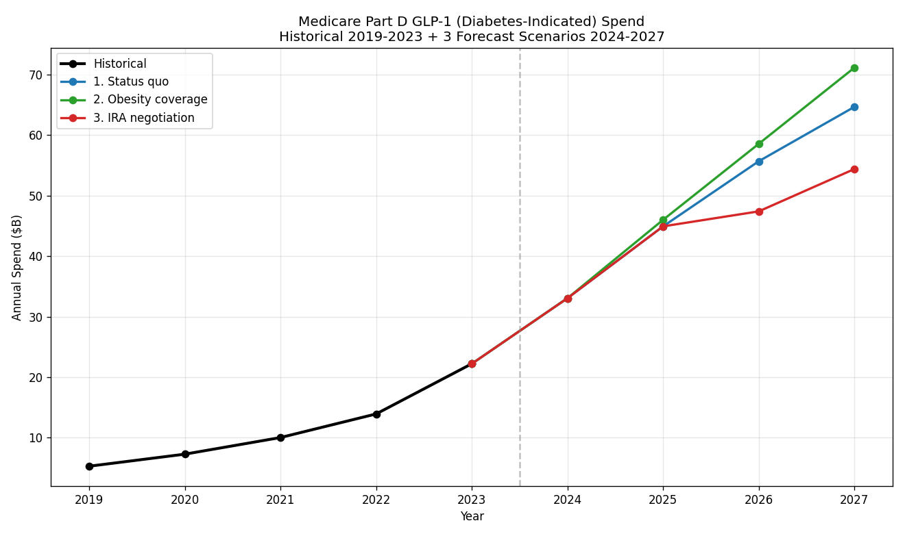

# Medicare Part D Drug Analytics — GLP-1 Deep-Dive

End-to-end analytics on five years of CMS Medicare Part D drug spending (2019–2023), with a dedicated investigation of GLP-1 receptor agonists — the drug class projected to consume **17–21% of Medicare Part D spending by 2027**.

**🚀 Live demo: [partd-analytics-hari.streamlit.app](https://partd-analytics-hari.streamlit.app/)** — interactive dashboard with searchable top-25 drug explorer, tunable 3-scenario GLP-1 spend forecast (2024–2027), and PBM utilization-management simulator.

**Status:** Analytical core complete (Phases 1–3). Interactive dashboard deployed (Phase 5). Power BI dashboard and memo deliverables in progress.

## Headline findings

### The macro Part D story (2019–2023)

- Medicare Part D gross spend grew **$97B in five years** ($179B → $276B), a 54% increase.
- **Three-quarters of that growth came from price and mix shift, not from more prescriptions filled.** Volume × Price decomposition: $22B (23%) volume, $66B (68%) price/mix, $8B (9%) interaction — closes exactly to total growth.
- **Cardiometabolic drugs alone drove ~$46B (47%) of total growth.** Within that, GLP-1 + SGLT-2 inhibitors together added $28.5B — a new metabolic-drug oligopoly reshaping the program.

### The GLP-1 deep-dive (2019–2023)

- GLP-1 diabetes drugs grew from **$5.3B to $22.2B** in five years — a 4.2× increase, +$16.9B in annual spend.
- GLP-1s now represent **8.1% of all Part D spending** and account for **17.5% of total Part D spend growth** since 2019.
- **Ozempic alone** rose from rank ~50 in 2019 to the **#2 Part D drug** by 2023 ($9.2B), growing at a **102% compound annual rate** — doubling each year for four consecutive years.
- **Policy crack identified:** Wegovy — statutorily excluded from Part D coverage under Section 1860D-2(e)(2)(A) of the Social Security Act — recorded **$199,774 in Part D spending across 47 unique beneficiaries** in 2023.

### The off-label inference (2023)

- **Ozempic beneficiary count grew 87.7% in 2023.** Trulicity, its direct GLP-1 competitor for the same diabetes indication, grew only 11.7%. Same class, same payment pathway, same target population — a 7.5× growth differential reflects demand beyond on-label diabetes treatment.
- Quantified: an estimated **590,000+ Medicare beneficiaries received Ozempic in 2023 for weight-loss-driven prescribing** rather than for incident diabetes treatment, exploiting the policy gap that excludes Wegovy from Part D coverage.

### The 2024–2027 forecast (3 scenarios)

| Year | Status quo | Obesity coverage | IRA negotiation |
|------|------------|-------------------|------------------|
| 2024 | $33.1B | $33.1B | $33.1B |
| 2025 | $44.9B | $46.0B | $44.9B |
| 2026 | $55.7B | $58.6B | **$47.4B** ← IRA bites |
| 2027 | **$64.7B** | **$71.2B** | **$54.4B** |

- **Status quo: GLP-1 diabetes spend nearly triples again**, $22B → $65B over four years. Another $42.5B added to Part D from one drug class.
- **Obesity coverage** adds ~$6.5B/yr by 2027 — modest at conservative uptake.
- **IRA negotiation** pulls ~$10.3B/yr out of Part D — one drug, one policy lever.
- **GLP-1 share of Part D by 2027:** 19% (status quo) → 21% (obesity) → 17% (IRA). Up from 2.9% in 2019.



### The policy-scissors insight

> Savings from negotiating Ozempic alone (~$10.3B/yr by 2027) roughly equal the cost of expanding Part D to cover obesity GLP-1s (~$6.5B/yr). Combining the two policies could nearly double Medicare's GLP-1-treated population — including obesity patients currently outside coverage — and still net savings.

### The PBM cost-containment story

- **$17.3B of 2023 Part D brand spend** sits on molecules where generics already exist (top 20). Triage suggests **$3–5B of realistic annual GDR-optimization savings.**
- **Lenalidomide** post-LOE: $3.9B still on brand vs $1.7B on generic (GDR 36%) — biggest one-molecule opportunity.
- **Insulin oligopoly**: $6.3B of brand-name insulin (Novolog / Humalog / Tresiba) with effectively zero biosimilar adoption — a rebate-contract phenomenon, not a clinical limitation.
- The CNS / psychiatric class shrank **−$4B (−30%)** as the last large SSRIs and antipsychotics went generic. **The PBM playbook of generic substitution is reaching its limits exactly as the GLP-1 cost wave arrives.**

---

## Tech stack

- **SQL:** DuckDB 1.5.3 (in-process analytical SQL)
- **Python:** pandas, duckdb-py, matplotlib (SQL execution + forecast modeling + chart generation)
- **Visualization:** matplotlib (forecast chart), Power BI (Phase 4), Streamlit (Phase 5)
- **Source control:** git + GitHub

---

## Data source

[CMS Medicare Part D Spending by Drug, Reporting Year 2025](https://data.cms.gov/summary-statistics-on-use-and-payments/medicare-medicaid-spending-by-drug)

- 14,309 drug-manufacturer combinations × 5 years = **71,545 long-format rows** after unpivot
- Annual gross-spending totals validated within **1.5%** of CMS published headline figures every year
- Grain: brand × generic × manufacturer × year. Aggregate queries use `Mftr_Name = 'Overall'` to avoid double-counting.

---

## Repository structure

---

## Phase roadmap

| Phase | Status | Scope |
|-------|--------|-------|
| 1. Foundation + GLP-1 baseline | ✅ Complete | Data load, schema reshape, GLP-1 family inventory, CMS validation |
| 2. Foundation SQL Analysis | ✅ Complete | YoY growth, top-25 ranking, Volume × Price decomposition, GDR opportunity, therapeutic class shift |
| 3. GLP-1 Deep-Dive | ✅ Complete | Conversion rate, off-label inference (593K excess Ozempic benes), 3-scenario 2024–2027 forecast |
| 4. Power BI Dashboard | ⏳ Next | 4-page interactive dashboard incl. dedicated GLP-1 page |
| | 5. Streamlit App | ✅ Complete | [Live web app](https://partd-analytics-hari.streamlit.app/) — searchable drug explorer + 3-scenario GLP-1 forecast + PBM UM simulator |
| 6. Memos + Polish | ⏳ | Executive memo (CFO), utilization memo (P&T committee) |
| 7. Interview prep | ⏳ | Talk track, resume bullets, LinkedIn post |

---

## SQL & analytical technique demonstrations

| Technique | File |
|-----------|------|
| Schema introspection | `sql/00_describe_schema.sql` |
| Conditional aggregation (pivot) | `sql/02_glp1_family_inventory.sql` |
| Molecule-level discovery filter | `sql/03_glp1_brand_discovery.sql` |
| CTEs + parent-brand normalization | `sql/04_glp1_family_normalized.sql` |
| `FILTER` clause + aggregate validation | `sql/05_annual_totals_validation.sql` |
| Window function — `LAG()` | `sql/06_annual_yoy_growth.sql` |
| Window function — `RANK()` | `sql/07_top25_drugs_growth.sql` |
| Multi-CTE algebraic decomposition | `sql/08_volume_price_decomposition.sql` |
| Conditional split aggregation | `sql/09_brand_vs_generic_gdr.sql` |
| Multi-CTE classifier + share calc | `sql/10_therapeutic_class_shift.sql` |
| Class-share evolution | `sql/11_glp1_conversion_rate.sql` |
| `LAG()` partitioned by brand | `sql/12_glp1_offlabel_inference.sql` |
| 3-scenario forecast model (Python) | `src/forecast_glp1.py` |
| Joins (FDA Orange Book layer) | Phase 6 polish |

---

## Executive talk track (90 seconds)

> *"Medicare Part D gross spend grew $97 billion between 2019 and 2023, from $179B to $276B. Three-quarters of that came from price and mix shift, not from more prescriptions being filled. Cardiometabolic drugs alone — diabetes plus anticoagulants — drove almost half of total growth. Within diabetes, the GLP-1 and SGLT-2 classes added $28 billion combined while older diabetes drugs lost ground; patients are migrating from cheaper to premium-priced therapies, not just newly entering treatment. Ozempic by itself rose from rank 50 in 2019 to the #2 drug in the entire Part D program by 2023, growing at 102% compound annually. My forecast projects GLP-1s reaching 17–21% of Medicare Part D by 2027 — depending on whether Medicare expands obesity coverage or selects Ozempic for IRA negotiation. Those two policies, surprisingly, roughly offset each other in dollar terms: implementing both could nearly double the GLP-1 patient population while netting savings. The PBM playbook of generic substitution is reaching its limits as the GLP-1 cost wave arrives — that timing mismatch is the structural pressure on Part D economics through 2027."*

---

## Reproducing locally

```powershell
# 1. Clone
git clone https://github.com/HarryAcharya/medicare-part-d-analytics.git
cd medicare-part-d-analytics

# 2. Install dependencies
pip install -r requirements.txt

# 3. Download CMS source data
#    Get the latest Medicare Part D Spending by Drug Excel file from
#    https://data.cms.gov and place it in data/raw/

# 4. Build the DuckDB database
#    (Manual via DuckDB CLI for now; build_db.py script planned for Phase 6.)

# 5. Run any analytical query
python src/run_sql.py sql/08_volume_price_decomposition.sql
python src/run_sql.py sql/12_glp1_offlabel_inference.sql

# 6. Regenerate the 3-scenario forecast + chart
python src/forecast_glp1.py

# 7. Regression-check the full Phase 1 baseline
python src/validate_phase1.py
```

---

## About

Built by [Hari Acharya](https://github.com/HarryAcharya) — analyst / data scientist focused on pharma, PBM, and payer applications. Chicago, IL.

- Email: acharyaharii95@gmail.com
- Tableau Public: https://public.tableau.com/app/profile/hari.acharya2369